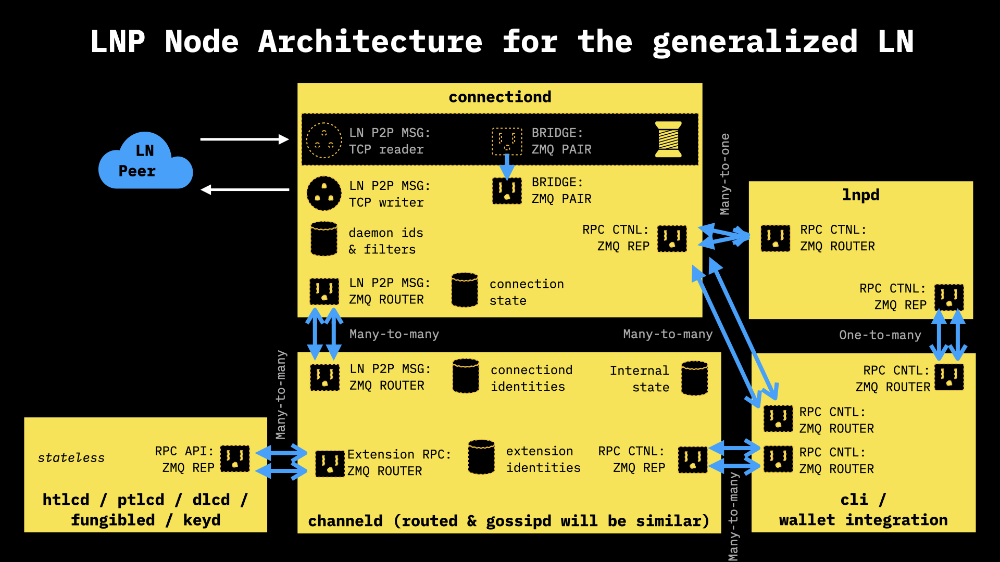
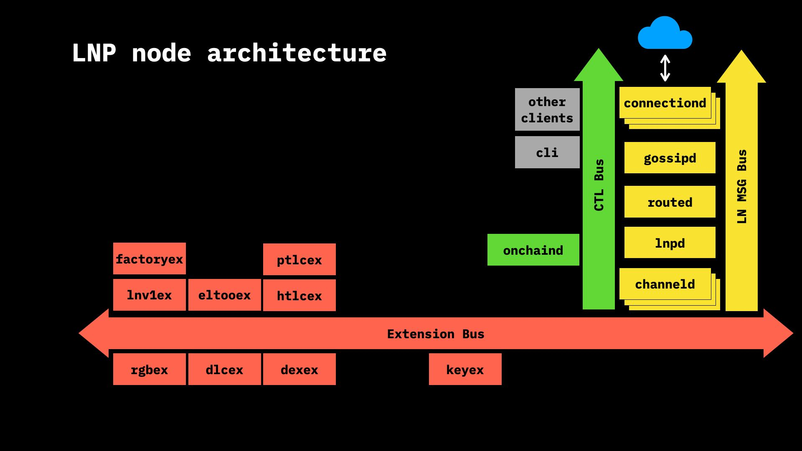

# lnp-node: Lightning Network Protocol Node

`lnp-node` is a new Lightning Network node written from scratch in Rust. 
Actually, it's a suite of daemons/microservices able to run both Lightning 
Network Protocol (LNP) and Generalized Lightning Channels (GLC).

One may ask: another LN node? Why we need it? And what is "Lightning network
protocol" and "Generalized Lightning Channels"?

**Lightning Network Protocol** is normal Lightning messaging protocol extracted
from BOLTs and extended to support arbitrary messaging, RPC, P2P and publish/
subscribe APIs over TCP/IP, TCP/Tor, UDP, ZeroMQ and high latency communication
channels (mesh/satellite networks) with end-to-end encryption. It is 100% LN
compatible (and in these terms Lightning Network runs on this protocol de-facto)
but allows much more than current LN uses. The protocol is defined as a set of
LNPBP15-19 standards, which are strict extensions of BOLTs. In other words, with 
this protocol you can do an arbitrary messaging (and build complex distrubuted 
systems without central authorities like DNS, SSL, IP addresses), so at LNP/BP
we use it everywhere, even for internal communications between microservices.

**Generalized Lightning Channels** is a way of defining payment channels in a
modular and extensible way such that you can easily add new transaction outputs 
to the commitment transaction, switch from HTLCs to PTLCs payments, use eltoo &
do a lot of experimenttion without inventing new messages and standards each 
time: peers are using LNP to negotiate channel and transaction structure with
partially-signed transactions.

Idea for both protocols came from Dr Maxim Orlovsky, Dr Christian Decker and
Giacomo Zucco discussions in 2019-2020 and implemented by Maxim Orlovsky as a 
part of [LNP/BP Core Library](https://github.com/LNP-BP/rust-lnpbp).
We recommend to watch to [Potzblitz about LNP Node](https://www.youtube.com/watch?v=YmmNsWS5wiM&t=5s&ab_channel=Fulmo%E2%9A%A1)
and [LNP/BP networking presentation](https://www.youtube.com/watch?v=kTwZKsbIPbc&t=2123s&ab_channel=LNPBPStandardsAssociation)
to get a deeper insight into these topics. Presentations slides are also 
avaliable:
* [LNP/BP Decentralization Solutions]()
* [Future of the Lightning Network]() (slides from the Postblitz talk)

## Rationale & features

The problem with the existing Lightning node implementations is their very 
limited extensibility for such things as:

* future LN upgrades ([channel factories](https://tik-old.ee.ethz.ch/file//a20a865ce40d40c8f942cf206a7cba96/Scalable_Funding_Of_Blockchain_Micropayment_Networks%20(1).pdf), 
  [payment points](https://suredbits.com/payment-points-part-1/), Taproot),
  since they do not separate network communication, channel operation and 
  channel parameters from each other in a well manner, such that it will be 
  possible, for instance, to replace HTLCs with payment points using some 
  extension/module.
* protocols on top of LN (layer 3), like DLCs or proposed 
  [Lightspeed protocol](https://github.com/LNP-BP/lnpbps/issues/24), which 
  require modification on the structure of the commitment transaction.

We name the extensions to Lightning network required to build this rich 
functionality a "Generalized Lightning Network". With this project 
[LNP/BP Standards Association](https://github.com/LNP-BP) is trying to build an 
LN node with extensible and highly-modular architecture, utilizing state of the 
art Rust approaches like:
* Microservice architecture
* Dockerization for scalability at the level of separate processes (per-channel 
  scalability etc)
* Tokio-based async/non-blocking IO and rumtime
* Fast and performant ZeroMQ for APIs and IPCs
* Avoiding non-efficient Bitcoin blockchain parsing and instead relying on new 
  [scalable blockchain indexing service](https://github.com/LNP-BP/txserv) and 
  new format of [universal bitcoin identifiers](https://github.com/LNP-BP/lnpbps/blob/master/lnpbp-0005.md)
* Mobile- & web-ready via C- and WASM-bindings & build targets for the core 
  components

This new node will be used to implement:

* Bidirectional channels
* [Channel factories/multipeer channels](https://tik-old.ee.ethz.ch/file//a20a865ce40d40c8f942cf206a7cba96/Scalable_Funding_Of_Blockchain_Micropayment_Networks%20(1).pdf)
* [Payment points](https://suredbits.com/payment-points-part-1/)
* [DLCs on LN](https://hackmd.io/@lpQxZaCeTG6OJZI3awxQPQ/LN-DLC)
* [RGB & Spectrum](https://github.com/rgb-org/spec)
* Future [Storm](https://github.com/storm-org/storm-spec) (storage & messaging) 
  edition for LN
* Future [Prometheus](https://github.com/pandoracore/prometheus-spec/blob/master/prometheus.pdf) 
  (high-load computing) edition for LN
* [Lightspeed payment protocol](https://github.com/LNP-BP/lnpbps/issues/24)

The node must maintain simple/modular upgradability for:

* RGB smart contracts (client-validated smart contract system)
* Discrete log contracts (DLCs)
* Schnorr's/Taproot
* Pay-to-elliptic curve point lock contracts (PTLC) - replacement for HTLCs
* eltoo

See [here](/doc/demo-beta.1) for a demo of the node capabilities as for version `v0.1.0-beta.1`.

See [here](/doc/demo-alpha.4) for a demo of the node capabilities as for version `v0.1.0-alpha.4`.

## Design

### Approach

The node (as other nodes maitained by LNP/BP Standards Association and Pandora
Core company subsidiaries) consists of multiple microservices, communicating
with each other via LNP ZMQ RPC interface.


The set of microservices representing node can run as either:
1) single daemon process on desktop or a server;
2) cloud of docker-based daemons, one per microservice, with instance 
   scalability and in geo-distributed environment;
3) inside a single mobile app as threads;
4) and even different nodes can be combined in their services between themselves
   into a single executables/mobile apps;
5) all P2P communications are end-to-end encrypted and work over Tor.

Other nodes, designed an maintained by LNP/BP Standards Association with the 
same architecture include:
* [RGB Node](https://github.com/LNP-BP/rgb-node) for running RGB smart contracts
  over bitcoin and lightning network
* [BP Node](https://github.com/LNP-BP/bp-node) for indexing bitcoin blockchain
  (you may think of it as a more efficient Electrum server alternative)
* Bifrost – node for storing/passing client-side-validated data with watchtower 
  functionality and used for Storm/RGB/DEX infrastructure

Other third parties provide their own nodes:
* [Keyring](https://github.com/pandoracore/keyring) for managing private key
  accounts, storage and signatures with support for miniscript and PSBTs
* [MyCitadel](https://github.com/mycitadel/mycitadel-node) Bitcoin, LN & RGB
  enabled wallet service with support for other LNP/BP protocols

### LNP Node Architecture Specifics

The overall architecture of LNP Node is the following:



More information on the service buses used in the node:




## Project organization & architecture

* [`src/bin/`](src/bin/) – binaries for daemons & CLI launching main process
* [`src/cli/`](src/cli/) – CLAP-based command line API talking to message bus
* [`src/rpc/`](src/rpc/) – RPC commands for all daemons used for message bus
* [`src/i8n/`](src/i8n/) – functions exposed to FFI talking to message bus
* `src/<name>/` – service/daemon-specific code:
  - [`src/peerd/`](src/peerd) – daemon managing peer connections 
    within Lightning peer network using LNP (Lightning network protocol). 
    Specific supported message types are defined as a part of 
    [LNP/BP Core Library](https://github.com/LNP-BP/rust-lnpbp)
  - [`src/channeld`](src/channeld) – daemon managing generalized Lightning
    channels with their extensions
  - [`src/lnpd`](src/lnpd) – daemon initializing creation of new channels and
    connections
  - [`src/routed`](src/routed) – daemon managing routing information
  - [`src/gossip`](src/gossip) – daemon managing gossip data
  - [`src/keyd`](src/keyd) - key managing daemon

Each daemon (more correctly "microservice", as it can run as a thread, not 
necessary a process) or other binary (like CLI tool) follows the same
organization concept for module/file names:
* `error.rs` – daemon-specific error types;
* `opts.rs` – CLAP arguments & daemon configuration data;
* `runtime.rs` – singleton managing main daemon thread and keeping all ZMQ/P2P 
  connections and sockets; receiving and processing messages through them;
* `index/`, `storage/`, `cache/` – storage interfaces and engines;
* `db/` – SQL-specific schema and code, if needed.

## Build and usage

### Local

To compile the node, please install [cargo](https://doc.rust-lang.org/cargo/),
then run the following commands:

```bash
sudo apt install -y libsqlite3-dev libssl-dev libzmq3-dev pkg-config
cargo install --path . --bins --all-features
cargo run --color=always --bin peerd --features=server -- --listen -vvvv
```

### In docker

```bash
docker build -t lnp-node .
docker run --rm --name lnp_node lnp-node
```

## Ways of communication

* IRC channels on Freenode
    * \#lnp-bp: discussions on this and other LNP/BP projects
    * \#rust-bitcoin: here you can get general support on rust-lightning
    * \#lightning-dev: here better to ask generic lightning-network questions
    * dr_orlovsky: my account on IRC
* Lightning Hackdays Mattermost channel:
  <https://mm.fulmo.org/fulmo/channels/x-rust-ln-node>
